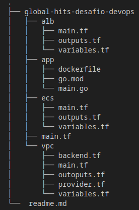

<div align="center">

</div>

# global-hits-desafio-devops

Desafio Devops

    | Desafio GlobalHitss |
    ---------------------------
    # Aqui está o que você precisa fazer:
    1) Crie uma VPC na AWS com subnets públicas e privadas utilizando Terraform.
    2) Crie um módulo Terraform para configurar um cluster ECS Fargate.
    3) Crie um módulo para configurar um Application Load Balancer (ALB) público que encaminhe o tráfego para a aplicação em execução no ECS.
    4) Disponibilize uma aplicação de exemplo (pode ser uma simples aplicação web) no ECS Fargate.
    5) O código da aplicação deve ser armazenado em um repositório do GitHub.

    # Passos detalhados:
    - Utilize um módulo para criar a VPC e subnets.
    - Utilize outro módulo para configurar o ECS Fargate, incluindo a definição do serviço e da tarefa.
    - Configure o ALB para rotear as requisições para as instâncias do ECS.
    - Certifique-se de que a aplicação esteja acessível publicamente através do ALB.

    # Crie um repositório no GitHub para entregar a solução. Não se preocupe em fazer tudo. 
    # O importante é demonstrar suas habilidades. Boa sorte e divirta-se!

Docker image, Build e Push:

```
cd app
docker login -u orbite82
docker build -t orbite82/go-ecs-example .
docker login -u orbite82
docker push orbite82/go-ecs-example
```


# Tree



├── global-hits-desafio-devops
│   ├── alb
│   │   ├── main.tf
│   │   ├── outputs.tf
│   │   └── variables.tf
│   ├── app
│   │   ├── dockerfile
│   │   ├── go.mod
│   │   └── main.go
│   ├── ecs
│   │   ├── main.tf
│   │   ├── outputs.tf
│   │   └── variables.tf
│   ├── main.tf
│   └── vpc
│       ├── backend.tf
│       ├── main.tf
│       ├── outoputs.tf
│       ├── provider.tf
│       └── variables.tf
└──  readme.md